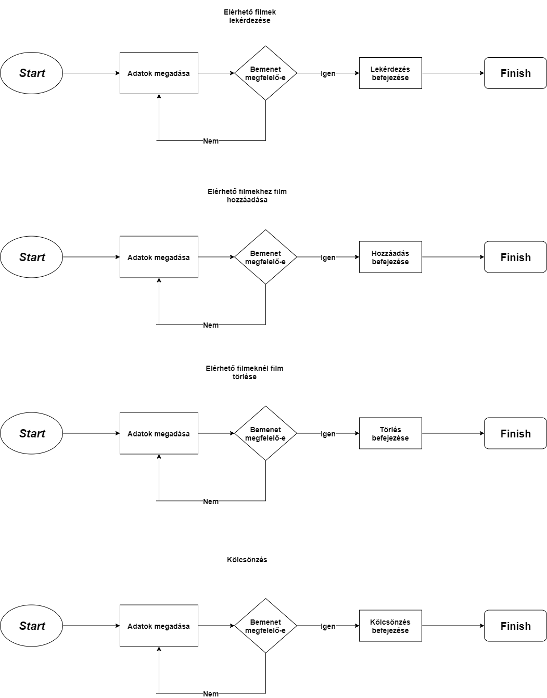
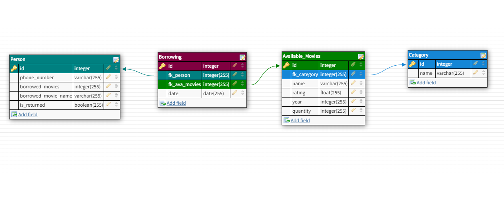

# Rendszerterv

### 1. A rendszer célja.

A rendszer célja, hogy a régi elavult papíron való adattárolást egy
modernebb, már a mai kor adatbiztonsági szabályainak megfelelő változatra
váltsa le. Az új rendszer már interneten működő, böngészőből elérhető
lesz. A felhasználó így bárhol elérheti majd, ahol lesz internetkapcsolat.
A munka gyorsabb, hatékonyabb és átláthatóbb lesz, így rengeteg felesleges
időpazarlásról szabadítja meg a felhasználót, nem mellesleg a programnak a
költsége elenyésző lesz a korábbihoz képest.Az ilyesfajta gondok, mint
például csőtörés, de akár egy véletlenszerű tűz baleset már nem befolyásolja
az adminisztratív munkákat.Mivel a weboldalon fog történni a kölcsönzés
"tárolása", így akár 2-3 kattintással is megoldható lesz egy kikölcsönzés
ami a kialakult sorok redukációját jelentheti. Maga a rendszeren gyakorlati
pozitívumán kivül, érzékelhető lesz, hogy a bolt korszerű eszközökkel ujít be
és ezen felül foglalkozik a bolttal.

### 2. A project tervezete.

#### 2.1. A rendszer felépítése

Az adatbázis kapcsolathoz szükséges egy adatbázis connection osztály,
amely létrehozza, fenntartja, és zárja az adatbáziskapcsolatot.

A rendszer SQL-t alkalmaz majd a filmek adatainak tárolásához, illetve
a kölcsönzés és bérlések adatai szintén hasonlóan lesznek tárolva.

A designhoz felfogjuk használni a Bootstrap4-et, amely segíteni fog a sötét téma előállításához.

A program controllerjeihez a Java programozási nyelvét fogjuk alkalmazni.
A projekthez illetve felhasználásra kerül a Maven nevű projekt menedzsment eszköztárai is.

#### 2.2. Projektmunkások és felelősségeik

A projektünkben 4 személy fogja fejleszteni a programunkat.

Az alábbi táblázattal tudjuk ismertetni a fejlesztőket és a szerepkörüket.

Név | Szerepkör
-----------|---------
Antal Balázs | frontend fejlesztő
Nagy Martin | backend fejlesztő
Udvardy Márton | backend fejlesztő
Szűcs Levente | frontend fejlesztő

### 3. Ütemterv.

### 3.1 Mérföldkövek

A program elkészítésének fő mérföldkövei:

#### 3.1.1. Sprint I.

- A Trelloban való regisztráció illetve a használatának elkezdése.
- A git repository elkészítése.
- A tagok git-re való regisztrációja és a projecthez való felvétele.
- A Követelémyspecifikáció elkészítése.
- A Funkcionális specifikáció elkészítése.
- A Rendszerterv elkészítése.

#### 3.1.2 Sprint II.

- A program elkészítésének megtervezése, felosztása.
- A program prototípusának elkészítése.
- A program tesztelése a minimálisan működő funkciókkal.
- A programnak a bemutatáshoz szükséges PPT elkészítése.

#### 3.1.3 Sprint III.

- A program adatbázisának elkészítése.
- A program controllerének elkészítése.
- A program tesztjeinek felállítása.
- Az adatbázis hozzákapcsolása a programhoz.
- A program fő tesztjeinek elvégzése.

#### 3.1.4 Sprint IV.

- A felhasználó visszajelzéseinek fogadása és áttekintése.
- Lehetséges hibák javítása.
- Plusz kisebb funkciók belehelyezése.
- A program biztonságának növelése.
- Átadás.

### 4. Üzleti szereplők.

A rendszer használatára való jogosultsága a tulajdonosnak lesz, jelen esetben a barátunknak.
Mindenfajta segítséget megadunk neki, hogy gördélékenyebben menjen a program használata.
Egy esetleges tulajdonos váltás esetén ez a jogosultság átruházható lesz, tehát kompatibilis a tulajdonos váltásra.

### 5. Követelmények.

A követelmények a program nagyságával egyenesen arányos.
Mivel nem egy bonyolult, átláthatatlan mennyiségű adatkezelésre szolgáló rendszer a végkifejlett, így a követelmények is minél egyszerűbb megoldást várnak el.

   *   Egy rendszer ami a barátunk boltjában lévő filmekhez tartozó adatokra tudsz lekérdezést végrehajtani.
   
   *   Egy adott filmről lekérdezést tudjunk végrehajtani név szerint
   
   *   Egy adott filmről lekérdezést tudjunk végrehajtani kategória szerint.
   
   *   Egy adott filmről lekérdezést tudjunk végrehajtani az adott évben kijött filmekről.
   
   *   Egy adott filmről megállípítható legyen, hogy kivan-e kölcsönözve.
   
   *   Ha egy film kivan kölcsönözve, abban az esetben egy telefonszám legyen mellé írva.
   
   *   Egy adott filmről információ, hogy mennyi áll összesen a rendelkezésére a tulajdonosnak.
   
   *   Egy adott filmről információ, hogy hány darab kölcsönözhető még ki.
   
   *   Letisztult, átlátható, egyszerű rendszer kialakítás.
   
   *   Nem kirívó, hanem annál inkább a szem kimélése érdekében sötétebb színek használata.
   
   *   Regisztráció nélküli használat.
   
   *   A weboldal betöltése után az össze funkció látható legyen.
   
   *   A főoldalon az összes opcióról elérhető legyen egy kisebb leírás.

### 6. Funkcionális terv.

* A program célja, hogy a kölcsönzési feladatokat átláthatóbbá és gyorsabbá tegyük.
A jelenlegi füzetes megoldás már nem naprakész és az alkalmazásunkkal ezt szereznénk lecserélni.
A jelenlegi funkciók mellett további funkciókat adunk hozzá.

* Az alábbi funkciók: 
    - Filmek elérhetőségének megjelenítése
    - Az elérhető filmeknek a mennyiségének megjelenítése 
    - Filmekre való keresés      
    - Filmekre keresés név,kategória,megjelenés éve alapján    
    - Filmek értékelésének kimutatása 
    - A jelenleg kikölcsönzött filmek kimutatása 
    - A kölcsönző ügyfélnek a telefonszámának megjelenítése
    - A kölcsönzés dátumának megjelenítése.
    
* Ezekkel a funkciókkal a kölcsönzés/bérlés a tulajnak sokkal kényelmesebbé válik.
 Ezek a funkciók sokkal egyszerűbbé válnak, hiszen ezek a funkciók digitálisak.
 Most már nem kell rögzíteni a kölcsönzést és a bérlést papíron, ehelyett
 gyakorlatilag már egy gombra kattintással lehet sok időtigénylő feladatot elintézni.
  Emellett az adatok sorbarendezesék szintén gombnyomásokkal működnek, ezzel megkönnyebbíti a tulaj dolgát.  
  
 * A tulajnak egyszerűbbé válik ezeknek a feladatoknak a vezetése.
 Ugyanis tudni fogja sokkal egyszerűbben, hogy az adott film (ami már
 ki van kölcsönözve) kihez tartozik és mikor adta ki. Ezen kívül sokkal
 egyszerűbben tudja ellenőrízni,hogy az adott filmből hány példány van még.
           
### 7. Rendszerszereplők.

A rendszert mint említettük a tulajnak készül azaz minden funkciót ő tudja alkalmazni. 

* A tulajnak a dolga sokkal egyszerűbb az előző papíros verzióhoz képest.

Az alábbi funkciók amelyek megkönnyebbíti a tulaj dolgát: 
  - Szűrések a filmek közül
  - Az adatok csoportosítva, sorbarendezve megtekinthetőek
  - Az adott filmekhez, adott telefonszámok vannak hozzárendelve
  - Hátralévő darabszámok felvannak tűntve az adott filmekhez   

### 8. Rendszerhasználati esetek és lefutásaik.

### 9. Fejlesztői eszközök.

* Java
* Maven
* SQL

### 10. Keretrendszer.

* Bootstrap 4

### 11. Architekturális terv.

Rendszert felépítő alrendszerek (szoftver komponensek) lényegében a Java ,Sql ,Mavan használata .
Az alrendszerek meghatározása után a tulajdonságaikat kiaknázva vezérlési, valamint kommunikációs kapcsolatokat lehet létrehozni ez által.
Ennek a megfelelő komponensek és összekötök ismeretében magas szintű tervezetet jön létre.
A rendszer szerepe az érdekelt szereplő kommunikációjának lehetővé tétele ,a korai fejlesztési fázisok döntéseinek támogatása a követelmények tükrében és emelet igen fontos a Nagy lépték" újrafelhasználhatóság elősegítése.
Ehez persze szükség van különféle forrásokra mint Üzleti és technológiai döntések eredménye ,meghatározó a környezet szerepe , fejlesztők céljai és stratégiája által befolyásolt követelmények vezetnek különféle szoftver architektúrákhoz.
Mint minden folyamat ez is egy ciklus körül forog mint az :

   * Architektúrát meghatározó fejlesztő szervezet szerkezetéből.
   
   * Szereplő.
   
   * Követelmények.
   
   * Technológiai környezet.
   
   * A tervező tapasztalata.

Architektúra elemek:

   * Architektúrális minta.
      * Típus elemek és kapcsolatok, kényszerek.
      * pl. kliens-szerver minta.
   
   * Referencia modell.
      * Standard funkcionális felosztás és adatfolyam megoldások.
      * pl. adatbázis kezelő rendszer.
   
   * Referencia architektúra.
      * Referencia modell leképezése szoftver elemekre.
      * pl. ISO OSI architektúra.
   

### 12. Adatbázis terv.

A program adatbázisát 4 tábla alkotja:

Elérhető filmek:

* id
* név
* értékelés
* mennyiség
* megjelenés éve
* fk_category

Kölcsönzés:

* id
* fk_person
* fk_ava_movies
* date

Személy:

* id
* telefonszám
* kikölcsönzött könyv neve
* kikölcsönzött könyvek száma
* visszahozta e

Kategória:

* id
* név

**Logikai Modell**:

Person                      |   Borrowing              |   Available_Movies   | Category
----------------------------|--------------------------|----------------------|---------------
ID primary key              | ID primary key           | ID primary key       | ID primary key
phone_number INTEGER        | fk_person INTEGER        | fk_category INTEGER  | name VARCHAR
borrowed_movies VARCHAR     | fk_ava_movies INTEGER    | name VARCHAR
borrowed_movie_name VARCHAR | date DATE                | rating FLOAT
is_returned BOOLEAN         |                          | year INTEGER
|                           |                          | quantity INTEGER
### 13. Implementációs terv.

A tervezési folyamatban célszerű az általános logikai felépítést mindig valamilyen grafikus reprezentációval modellezni, mert az emberi agy vizualizált objektumokkal könnyebben dolgozik.
Az UML (=Unified Modeling Language), modellező nyelv segítségével a specifikációt és a tervezést is grafikus formában, diagramok segítségével tudjuk dokumentálni.
A követelményspecifikációban a használati esetdiagramokat (use case), az adatbázis tervezésnél az adatbázis diagramot, az OOP tervezésnél az osztálydiagramot és objektumdiagramot valamint a szekvenciadiagramot, aktivitásdiagramot használhatjuk.

### 14. Tesztterv.

Pont|Leírás|  
----|---  
01: | Az oldal betöltése hibáktól mentes.  |
02: | Az oldal méretének változtatása nincs hatással a megfelelő kezelhetőségre.
03: | Minden menü gomb jó helyre vezet.
04: | Elérhető filmek menüben jelzi összesen hány film van az adatbázisban.
05: | Elérhető filmek menüben mind a hat opció: keresés név alapján, keresés évszám alapján, keresés kategória alapján, kombinált keresés, film hozzáadása, film törlése megjelenik.
06: | Elérhető filmek menüben mindegyik opció megfelelően működik.
07: | Elérhető filmek menüben az összes opción belül minden rubrika kattintható és inputot fogad.
08: | Elérhető filmek menüben bármelyik rubrika üresen hagyása hibát dob.
09: | Hibás input beadásakor megfelelő hibaüzenetet ad vissza.
10: | Sikeres lekérdezés esetén a megadott opcióknak megfelelő filmet / filmeket adja vissza.
11: | Új film hozzáadásakor frissül az elérhető filmek száma.
12: | Új film hozzáadásánál ha már egy létező filmet adunk hozzá, akkor a film darabszáma nő.
13: | Új film hozzáadása csak minden rubrika kitöltésével lehetséges.
14: | Hibás inputokkal nem lehet új filmet hozzáadni.
15: | Film törlése megfelelő inputokkal működik.
16: | Film törlése invalid inputokkal hibát dob.
17: | Film törlésekor, ha a film többször szerepel az adatbázisban, akkor a darabszámot csökkenti.
18: | Film törlésekor frissül az elérhető filmek száma.
19: | Személy menüben jelzi a jelenleg kikölcsönzött filmek számát.
20: | Személy menüben mind a három opció: adatok hozzáadása, adatok lekérdezése, adatok törlése megjelenik.
22: | Személy menüben mindegyik opció megfelelően működik.
23: | Személy menüben az adatok hozzáadása megjelenik.
24: | Személy menüben az adatok hozzáadása működik.
25: | Kihagyott / üres rubrika esetén az adat beadása sikertelen.
26: | Hibás adat megadásakor nem változik a jelenleg kikölcsönzött filmek száma.
27: | A hozzáadás hibás input esetén hibát dob.
28: | Hozzáadás esetén a checkbox a film kintlétét jelzi.
29: | Egy telefonszámhoz több film is adható.
30: | Egy telefonszám egyszer szerepel az adatbázisban.
31: | Személy menüben az adatok lekérdezése megjelenik.
32: | Személy menüben az adatok lekérdezése működik.
33: | Kihagyott / üres rubrika esetén a lekérdezés sikertelen.
34: | A lekérdezés hibás input esetén hibát dob.
35: | Sikeres lekérdezése esetén a telefonszámhoz tartozó összes filmnevet visszaadja.
36: | Lekérdezés esetén a visszahozott filmek állapotát helyesen jelzi.
37: | Lekérdezés esetén a kintlévő filmek állapotát helyesen jelzi.
38: | Személy menüben az adatok törlése megjelenik.
39: | Személy menüben az adatok törlése működik.
40: | Törlés létező telefonszámmal működik.
41: | Egy telefonszám törlésekor az összes hozzá tartozó adat törlődik.
42: | Törléskor a kikölcsönzött filmek száma frissül.
43: | Törlés invalid inputtal hibát dob.
44: | Kölcsönzés menüben az adatok lekérdezése megjelenik.
45: | Kölcsönzés menüben az adatok lekérdezése működik.
46: | Kölcsönzés menüben mind a három opció: adatok hozzáadása, adatok lekérdezése, adatok törlése megjelenik.
47: | Kihagyott / üres rubrika esetén az adat lekérdezése sikertelen.
48: | A lekérdezés hibás input esetén hibát dob.
49: | Kölcsönzés menüben az adatok hozzáadása működik.
50: | Kölcsönzés menüben az adatok hozzáadása megjelenik.
51: | Kihagyott / üres rubrika esetén az adat beadása sikertelen.
52: | A hozzáadás hibás input esetén hibát dob.
53: | Egy dátumhoz több film is rendelhető.
54: | Egy személy többször is kiveheti ugyan azt a filmet.
55: | Kölcsönzés menüben az adatok törlése megjelenik.
56: | Kölcsönzés menüben az adatok törlése működik.
57: | A törlés hibás input esetén hibát dob.
58: | Kihagyott / üres rubrika esetén az adat törlése sikertelen.
59: | Kategória menüben mind a három opció: adatok hozzáadása, adatok lekérdezése, adatok törlése megjelenik.
60: | Kategória menüben az adatok hozzáadása megjelenik.
61: | Kategória menüben az adatok hozzáadása működik.
62: | A hozzáadás hibás input esetén hibát dob.
63: | Kihagyott / üres rubrika esetén az adat beadása sikertelen.
64: | Kategória menüben az adatok lekérdezése megjelenik.
65: | Kategória menüben az adatok lekérdezése működik.
66: | A lekérdezés hibás input esetén hibát dob.
67: | Kihagyott / üres rubrika esetén az adat lekérdezése sikertelen.
68: | Kategória menüben az adatok törlése megjelenik.
69: | Kategória menüben az adatok törlése működik.
70: | A törlés hibás input esetén hibát dob.
71: | Kihagyott / üres rubrika esetén az adat törlése sikertelen.
72: | A vissza gomb az összes oldalon működik.
73: | A vissza a főoldalra gomb az összes oldalon működik.